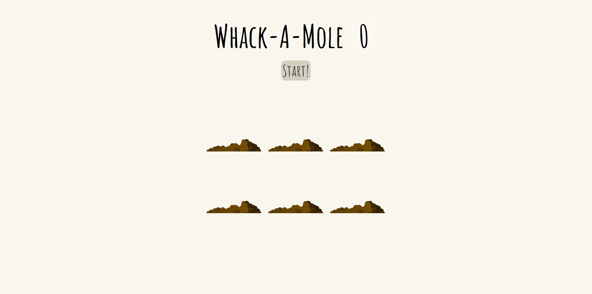

#  Whack a Mole Game

This is one of the projects I built during the WesBos JS 30 Day Course. By pressing start the moles pop up at random intervals. Try to whack as much of them
as you can.

## Table of contents

- [Overview](#overview)
  - [Screenshot](#screenshot)
  - [Links](#links)
- [My process](#my-process)
  - [Built with](#built-with)
  - [What I learned](#what-i-learned)
  - [Continued development](#continued-development)
  - [References](#references)
- [Author](#author)

## Overview

### Screenshot
|  
| ------------------------------ |
| Design Preview                |

### Links

- GitHub Profile: [GitHub URL](https://github.com/Dayne2x)
- Live Site URL: [GitHub Pages Live URL](https://dayne2x.github.io/Whack-A-Mole-Game/)

## My process

### Built with:

  
  
  

### What I learned

As per the usual more practise with writing functions, the moles pop up at random times between 200 ms and 2 sec, also the hole the moles pop up from are random.

### Continued development

Next projects should be a few from FrontEnd mentor.

### References and Acknowledgements

Project completed and inspired by the WesBos 30 Day JS Course.  

[ Whack A Mole Game - #JavaScript30 29/30 ](https://www.youtube.com/watch?v=toNFfAaWghU)

## Author
You can find me at:

- Frontend Mentor - [@Dayne2x](https://www.frontendmentor.io/profile/Dayne2x)
- GitHub - [Dayne2x](https://github.com/Dayne2x)
- LinkedIn - [Nemanja](https://www.linkedin.com/in/nemanjadayne/)
